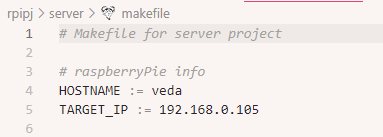
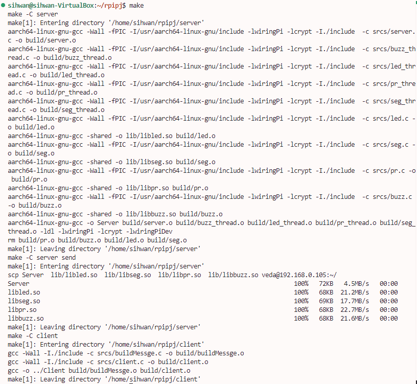
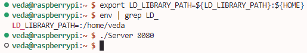
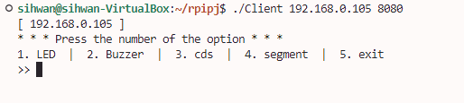
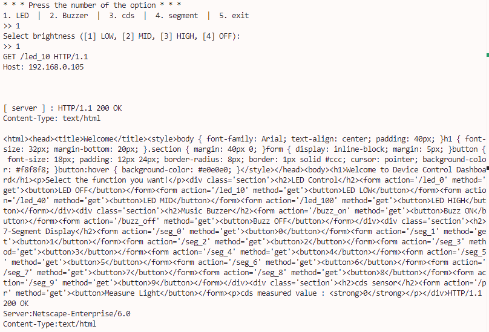
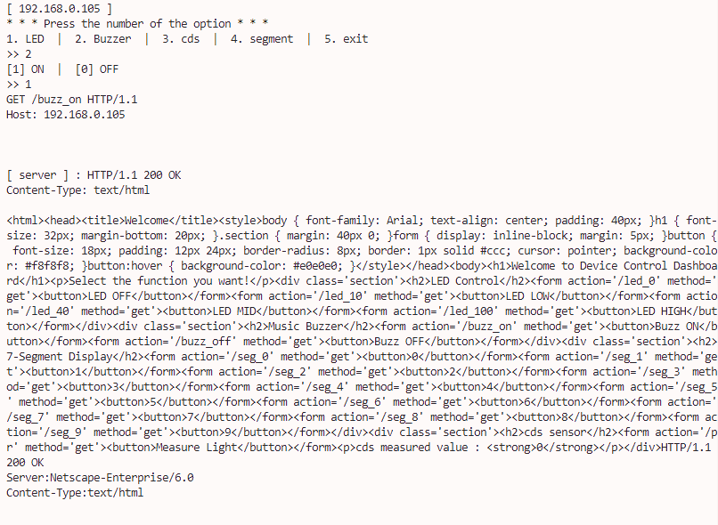
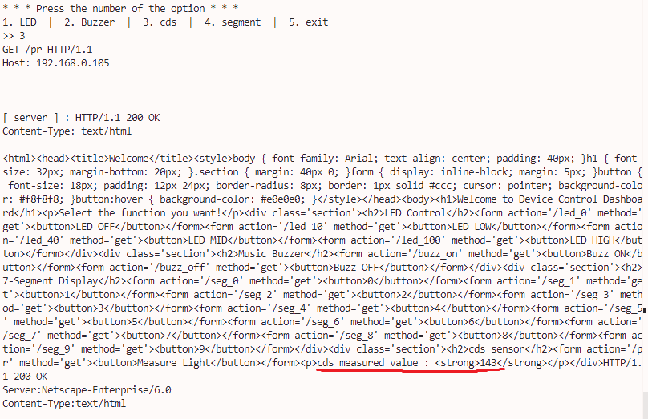
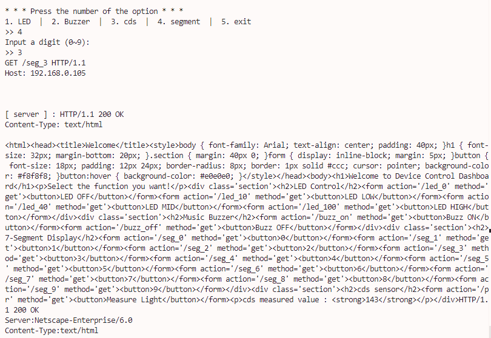

# RPIproject

## 프로젝트 소개

- TCP 를 이용한 원격 장치 제어 프로그램 만들기

- 서버 : 라즈베리파이4
- 클라이언트 : 우분투 리눅스

## 구현내용

### 서버
- 멀티 스레드를 활용한 각 장치 제어 및 멀티유저 환경 구현

- LED on, off 및 밝기 조절(LOW, MID, HIGH)

- 클라이언트에서 음악소리 on, off 제어

- 클라이언트에서 조도 센서 값 확인
- 빛이 감지되지 않으면 LED on, 밫이 감지되면 LED off

- 클라이언트에서 전송한 숫자가 7-세그먼트 표시
- 1초 경과 시 1 씩 값이 감소하여 0이 되면 부저 울림.

- **웹서버 형식 구현**을 통해 웹 브라우저에서 접속 및 장치제어 가능.
- 뮤텍스를 통해 여러 명령 입력에 대해 순차적인 장치 제어가 가능하도록 설계

### 클라이언트
- 서버 접속 및 명령창에 들어온 알맞은 입력을 서버로 전송.
- 입력 받은 숫자 기반으로 웹 서버 프로토콜에 맞추어 메시지 전송

## 빌드 방식

1. server/makefile 내 HOSTNAME, TARGET_IP 입력

HOSTNAME : 라즈베리파이 내 계정명 입력
TARGET_IP : 라즈베리파이 IP 주소 입력

2. 프로젝트 홈 디렉토리의 최상위 Makefile 실행

- 최상위 메이크파일이 server/client의 메이크파일을 실행시킴
- server 및 client의 실행파일 및 라이브러리가 생성
- 서버파일들은 라즈베리파이의 홈 디렉토리로 전송됨(scp 이용)

3. 라즈베리파이 서버 동작시키기

- 라즈베리파이 서버 동작 전, 동적라이브러리들의 위치를 명시해줘야함.

`export LD_LIBRARY_PATH="${LD_LIBRARY_PATH}:${HOME}"`

- 현재 실행파일과 동적 라이브러리 파일들이 위치한 라즈베리파이의 홈디렉토리를 LD_LIBRARY_PATH 환경변수에 등록.

제대로 동작 시 데몬 프로세스로 서버가 동작하게 된다.

4. 우분투 리눅스에서 클라이언트 실행하기

이후 프로젝트 홈 디렉토리에 생성된 Client 실행파일을 실행

`Usage : ./Client <IP address> <port>

서버와 잘 연결되었을 경우, 메뉴창이 나타나게 된다.

## CLI 환경 클라이언트 동작 과정

### 1. LED

- 메뉴에서 1을 입력해주면 LED에 대한 상세옵션 메뉴가 뜨고, LED불빛 선택하여 켜기와 불끄기를 선택할 수 있음.

- 이상한 값 입력 시, Invalid input 이라는 문구가 뜨며 메인메뉴로 돌아간다.

### 2. Buzzer

- 메인메뉴에서 2번 Buzzer 선택 후 1 - ON, 2 - OFF 로 음악을 켜고끌수 있음.

### 3. 조도센서

- 조도센서 선택 시 입력받은 그 순간의 환경의 광량을 감지하여 일정 수준 이하면 LED가 켜지고 이상이면 LED가 꺼짐.

- 광량 정보가 클라이언트로 리턴됨.

### 4. 7-세그먼트

- 메인메뉴 4번 선택 -> 세그먼트 시작 숫자값 기입 (0 ~ 9 범위)
- 1초마다 숫자값이 1 감소하여 0이 되면 부저가 울림.

### 5. exit

- 연결된 소켓을 닫고 정리하고 클라이언트를 종료함.

## 웹 브라우저 환경 클라이언트 동작 과정

- 라즈베리파이의 IP주소, 포트번호를 통해 웹 브라우저에서 서버 접속이 가능하다.

ex : `http://192.168.0.105:8081/`

- 버튼을 누르면 장치 제어를 할 수 있음.

